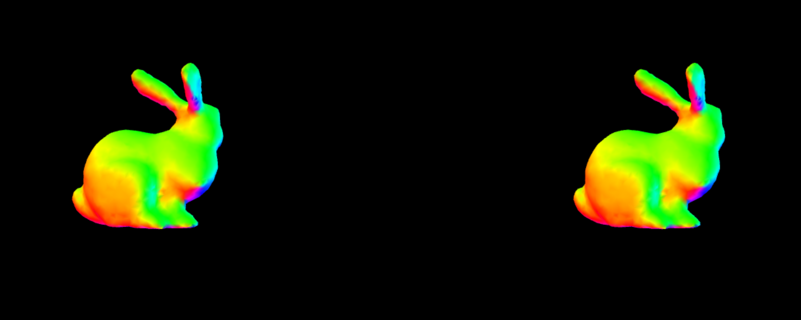

regl-stereo
===========
A simple side-by-side stereo renderer for [`regl`](https://github.com/mikolalysenko).



## Example

```javascript
const regl = require('regl')({
  pixelRatio: 1
})
const stereo = require('regl-stereo')({regl})
const normals = require('angle-normals')
const bunny = require('bunny')
const mat4 = require('gl-mat4')

const drawMesh = regl({
  vert: `
  precision highp float;

  attribute vec3 position, normals;
  uniform mat4 projection, view, model;

  varying vec3 fragColor;

  void main () {
    vec3 color = normals;
    float minC = min(min(color.x, color.y), color.z);
    float maxC = max(max(color.x, color.y), color.z);
    fragColor = (color - minC) / (maxC - minC);
    gl_Position = projection * view * model * vec4(position, 1);
  }
  `,

  frag: `
  precision highp float;

  varying vec3 fragColor;

  void main () {
    gl_FragColor = vec4(fragColor, 1);
  }
  `,

  attributes: {
    position: bunny.positions,
    normals: normals(bunny.cells, bunny.positions)
  },

  elements: bunny.cells,

  uniforms: {
    model: ({tick}) =>
      mat4.rotateY(
        mat4.create(),
        mat4.identity(mat4.create()),
        0.01 * tick),
    view: ({tick}) =>
      mat4.lookAt(
        mat4.create(),
        [0, 2.5, -(20.0 + 10.0 * Math.cos(0.01 * tick))],
        [0, 2.5, 0],
        [0, 1, 0])
  }
})

regl.frame(() => {
  regl.clear({
    color: [0, 0, 0, 1],
    depth: 1
  })

  stereo({
    zNear: 0.25,
    zFar: 1000.0,
    separation: 0.5
  }, () => {
    drawMesh()
  })
})

```

## API

#### `const stereo = require('regl-stereo')(options)`
Creates a new stereo camera. `options` has the following parameters:

* `regl` is a reference to the `regl` context

**Returns** A new stereo renderer

#### `stereo(props, block)`
Renders a stereo view with the given properties.  `block` is a command that draws the scene.

`props` has the following arguments:

* `sepration` is the eye separation distance
* `fov` is the fov of the projection matrix
* `zNear` is the near clip plane distance
* `zFar` is the far clip plane distance

This sets the viewport, scissor box and projection matrix uniform.

## License
(c) 2016 Mikola Lysenko. MIT License
